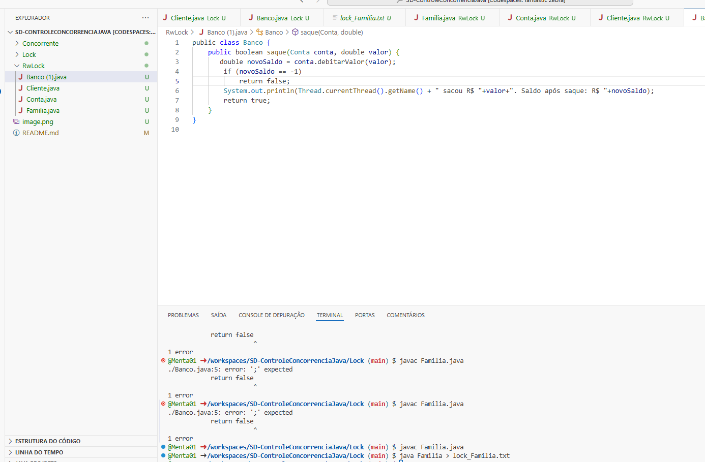
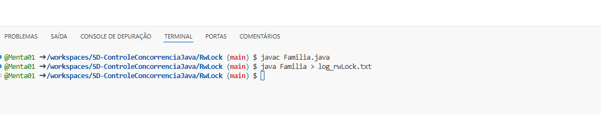

# SD-ControleConcorrenciaJava

Erro Concorrente ? 

Concorrente = 

Lock = 

RWlOCK = 

Log de Concorrente
Problema: As threads (Pai, Filho e Mãe) tentam sacar dinheiro ao mesmo tempo, causando erros no saldo.
Solução: Usar sincronização para garantir que apenas uma thread modifique o saldo de cada vez.
Log de Lock
Problema: O Lock evita acessos simultâneos, mas o saldo não é verificado corretamente antes de um saque.
Solução: Melhorar a verificação do saldo dentro do bloqueio para evitar saques indevidos.
Log de Rlock
Problema: O RwLock permite múltiplas leituras, mas não garante que o saldo seja atualizado corretamente durante um saque.
Solução: Usar um bloqueio de escrita correto para evitar problemas de concorrência.

